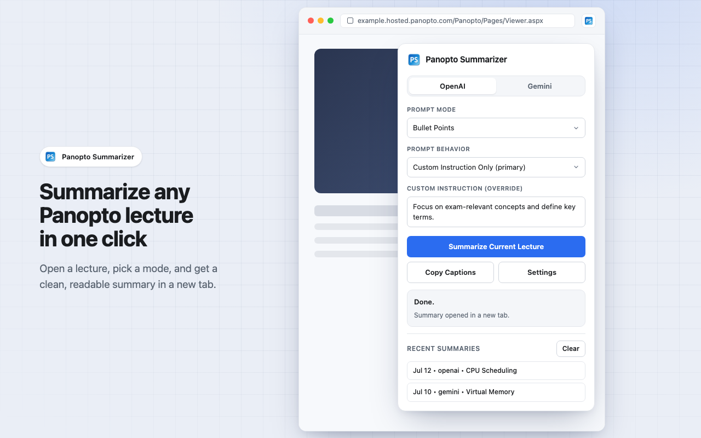
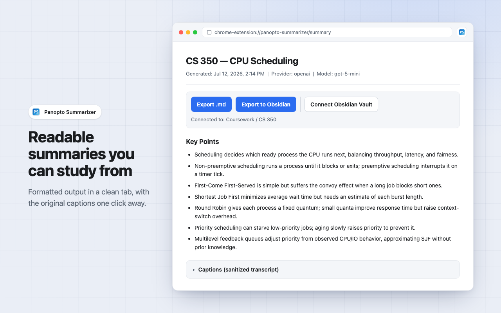
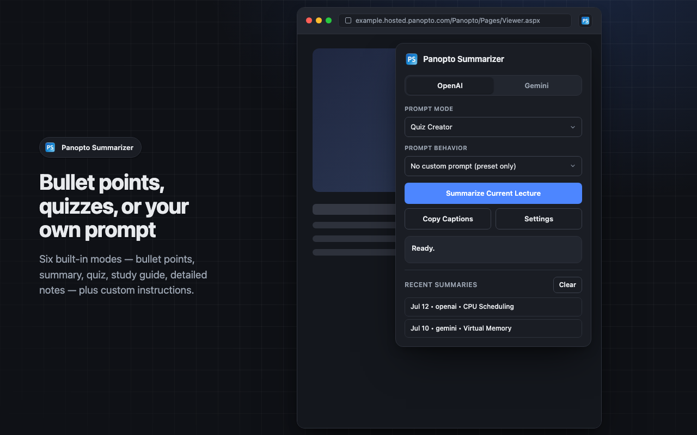
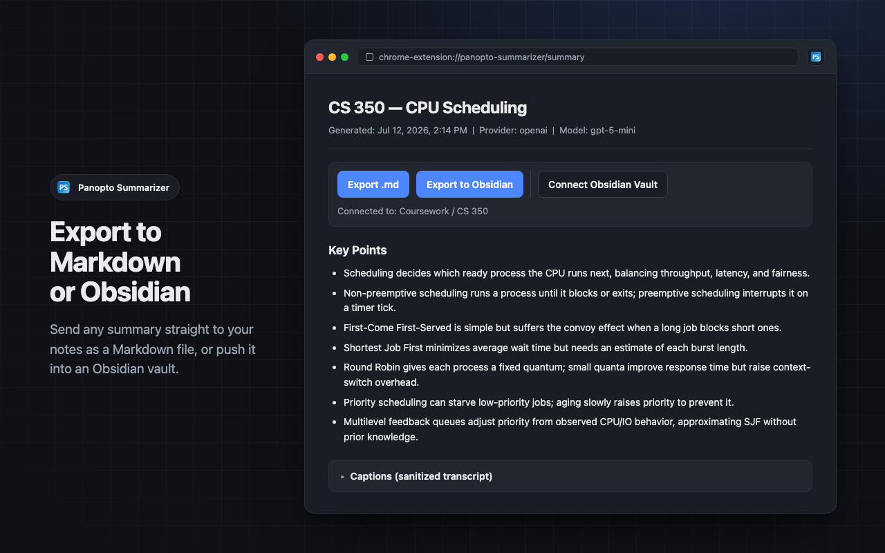

# Panopto Summarizer

Turn any Panopto lecture into notes, bullet points, or a quiz using your own OpenAI or Gemini key. Everything stays local.

## Install

**[Get it on the Chrome Web Store](https://chromewebstore.google.com/detail/panopto-summarizer/cpeanbbcgghgjbpjpkgidndkmhgoplob)**

Want to run it from source or hack on it instead? See [SETUP.md](SETUP.md).

## What it looks like

Summarize the lecture you're watching in one click:

Get a clean, readable summary you can study from:

Pick a style — bullet points, quiz, study guide, or your own prompt:

Export to Markdown or straight into an Obsidian vault:

## Bring your own key

The extension ships with no API key and no server. Add your OpenAI or Gemini key in the extension options — it's stored only in your browser via `chrome.storage.local`, and captions are sent directly to the provider you pick, only when you click Summarize. See [PRIVACY.md](PRIVACY.md) for details.
